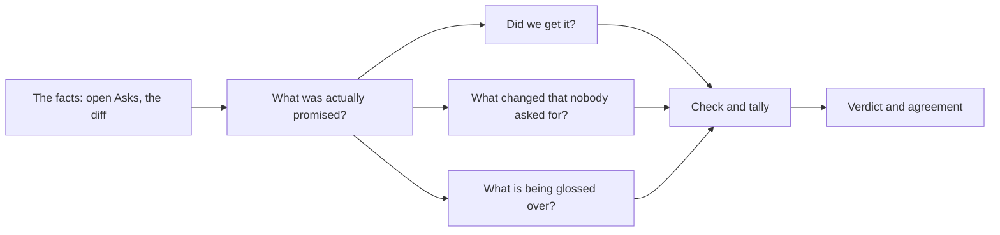

# Eval

**You asked for some things. Eval looks at what actually changed and asks
several independent judges whether you got them.**

`/rf:eval` in Claude Code, `$rf:eval` in Codex. On Codex, ask for sub-agents
explicitly — see [asking for judges](#asking-for-judges).



Eval compares **the diff against what you confirmed**. It finds things you asked
for that are missing, and things that changed that no Ask explains.

It does not watch *how* the work was done. Whether your agent wrote the test
first is not something Eval can see.

The skill tells your agent to ask you nothing and to run no builds or tests
during an Eval. That is an instruction, not a sandbox.

## What it judges against

An Ask is **open** from the moment it compiles until you cancel it or a Seal
closes it. Eval takes every open Ask, in order.

Unconfirmed prompts count as context, not obligations. Confirmed ones are the
obligations — including later revisions that changed them and withdrawals that
dropped them.

Your ordinary chat is never stored. But hooks do count how many plain prompts
went by, which is often what explains a change no Ask asked for.

**Eval needs Git.** It has to diff something against something.

The starting point is, in order: `--anchor` if you gave one, the last Seal's
commit, then the earliest base commit among the open Asks. If none of those
exist it stops and asks. The end point is `HEAD` when your tree is clean,
otherwise the working tree as it stands:

| Subject | What is recorded |
| --- | --- |
| `git_commit` | The commit, and the tree hash — for a nested project, just that project's subtree |
| `worktree` | The path, and a digest over every file's path, mode, and contents, untracked files included |

## The judges

`eval open` writes a brief: which Asks are open, the start and end points, how
many files changed, any earlier Eval covering the same Asks, and the known
limitations. Beside it, Git writes `changes.patch`: the exact diff, untracked
files included, which every judge reads instead of hunting for it. If an Eval is
already open over those same Asks, you continue with that one rather than
starting a second.

A **context** agent reads the patch and writes a short map of what changed in
each file. It votes on nothing; judges read it first and cite the patch or the
files, never the map.

Then four judges, and they have different jobs:

1. **Intent** — reads the Asks and writes down what was actually promised, marking
   each item `active`, `revised`, or `withdrawn`, traced back to its Ask.
2. **Coverage** — did we get each active item?
3. **Drift** — what changed that nobody asked for?
4. **Adversary** — what is being glossed over?

The last three each vote `yes`, `no`, or `unknown` per item, and label every
changed file `required`, `consequence`, or `unexplained`.

They are meant to run as separate agents that cannot see each other's answers.
If your host genuinely has no sub-agent tool, the skills allow four passes in
one context instead — but that gets marked `shared_context` and the reason has
to be stated. A slow tool or a permission prompt is not a reason to fall back.

`eval close` needs at least three judgement files tied to that exact brief,
votes on every active item, and a label on every changed file. The CLI records
what the judges said about their own identity and independence. It cannot
*verify* they were independent.

## Reading the verdict

| Verdict | When |
| --- | --- |
| `aligned` | Every active item got a yes, and no file is unexplained. |
| `drifted` | An item got a no, or a file came back unexplained. |
| `incomplete` | No active items, votes left unresolved, or the code changed while Eval was running. |

**Confidence is agreement, not correctness.** It is the lowest agreement among
the questions that were actually in doubt. Three judges who all agree and are
all wrong produce high confidence. Read it as "how much did they disagree",
nothing more.

Ties go the cautious way: an item ties to `unknown`, a file ties to
`unexplained`. If nothing was in doubt, confidence is `0.0`. No active items
always gives `incomplete`, and so does code changing underneath the Eval.

## Asking for judges

Your host agent runs the Eval skill and spawns the judges. **The RingFrame CLI
never spawns anything.**

| Host | How the skill asks |
| --- | --- |
| [Claude Code](https://github.com/fab7hq/fab7/blob/main/products/ringframe/plugins/claude/skills/eval/SKILL.md) | Foreground `Agent` calls; `Read` for evidence, `Write` for the judge files |
| [Codex](https://github.com/fab7hq/fab7/blob/main/products/ringframe/plugins/codex/skills/eval/SKILL.md) | Fresh native agent contexts (`fork_turns: "none"` where available) |

On Codex, say so when you invoke it — every time, even with sub-agent tools
already on:

```text
$rf:eval use native sub-agents
```

Those words cannot create a tool that is not there, or force your host to spawn
anything. Your host owns that.

## Stages, models and efforts

An Eval runs in two stages that hand over through files, so each stage can run
in a different harness without seeing the other's conversation:

| Stage | What runs | What it leaves |
| --- | --- | --- |
| **gather** | `eval open` (the brief, and `changes.patch` from Git) and the context agent | `context.md`, published with `ringframe eval context` |
| **debate** | the intent judge and the three assessors | the verdict |

Plain `/rf:eval` runs both in one harness. To split them, gather in one and
debate in the other, by the Eval ID the first prints:

```text
$rf:eval gather                  # Codex: open, map the change, print the Eval ID
/rf:eval debate evl_01M…         # Claude Code: judge that Eval from its files
```

Each role — `context`, `intent`, `coverage`, `drift`, `adversary` — can be given
a model and an effort as `role=model/effort`, after the stage if there is one:

```text
/rf:eval drift=claude-sonnet-5/high adversary=claude-opus-5-5/high
$rf:eval gather context=gpt-6-luna/low
/rf:eval debate evl_01M… adversary=/xhigh
```

Either side may be empty: `adversary=/xhigh` names only an effort. **Whatever you
leave out runs on the plugin's tiers**: each plugin ships
`skills/eval/config.toml` with a model and effort per role for its harness
([Claude Code](https://github.com/fab7hq/fab7/blob/main/products/ringframe/plugins/claude/skills/eval/config.toml),
[Codex](https://github.com/fab7hq/fab7/blob/main/products/ringframe/plugins/codex/skills/eval/config.toml)).
A role's model and its effort are each the first of your word, that file, and
the harness's default — on Claude Code, `CLAUDE_CODE_SUBAGENT_MODEL` or the
session's model, and the session's effort; on Codex, the `[agents]` defaults in
its own `config.toml`. The plugin's file is replaced on every update, so do not
edit it: change tiers in Weft or with the words. RingFrame checks no model
name: a wrong one fails when the harness spawns the agent, and the record says
which judge reported running on a different model.

In [Weft](https://github.com/fab7hq/weft) you do not type any of this. Weft
keeps your choices in `[eval.gather]` and `[eval.debate]` of
`~/.fab7/weft/config.toml`, and `[E]VAL` types them — one stage per keypress
when the two stages run in different harnesses. It also types any RingFrame
overrides from that file's `[ringframe]` table as `--override '<json>'`, right
after `/rf:eval`.

## What is recorded

`evals/<eval_id>/` holds the brief, `changes.patch`, the context map when there
is one, the intent, each judgement, and the final record — votes, what was
missing, what was unexplained, the limitations, what changed since the last Eval
of the same Asks, and the model and effort each role was asked to run on.

That comparison matches items by ID first, then by wording, then by overlap.
It is a best effort at "is this the same obligation, reworded", not a proof.

```sh
ringframe eval open --agents '{"context":{"effort":"low"}}'
ringframe eval context --eval <eval_id> --map @map.md --host codex
ringframe eval close --eval <eval_id> --intent @intent.json \
  --judgement @coverage.json --judgement @drift.json --judgement @adversary.json \
  --agents '{"adversary":{"model":"claude-opus-5-5","effort":"high"}}'
ringframe eval list --json
```

**Eval never blocks [Seal](seal.md).** A bad verdict is information for your
decision, not a gate on it.
